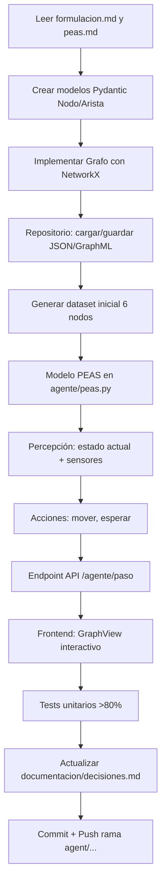

# AGENTS.md - Guía para Agentes de IA en Proyecto_IA

Este archivo define las reglas de colaboración, estructura y comandos para agentes de IA (Claude, Cursor, Copilot, etc.) trabajando en el **Sistema Inteligente para Planificación de Rutas y Análisis de Movilidad**.

---

## 🤖 Descripción General

**Proyecto académico** - Curso Inteligencia Artificial (SIST5036), Universidad Sergio Arboleda, Semestre VI, 2026.

**Stack tecnológico:**
- **Backend:** Python 3.11+, FastAPI, NetworkX, OSMnx, scikit-learn, GeoPandas
- **Frontend:** Nuxt 3 (Vue 3), TypeScript, D3.js / Cytoscape.js, TailwindCSS
- **Datos:** OpenStreetMap (OSM), GeoJSON, GraphML, CSV

---

## 🛡️ Reglas de Colaboración Multi-Agente

### 1. Ramificación Aislada
- **NUNCA** commitear directamente a `main` o `dev`
- Crear rama: `agent/<nombre-agente>/<caracteristica>`
  - Ejemplo: `agent/claude/grafo-modelo`, `agent/copilot/frontend-viz`

### 2. Commits Atómicos
- Un commit = un cambio lógico completo
- Mensaje convencional: `tipo(scope): descripción`
  - `feat(grafo): agregar modelo Nodo y Arista con validación Pydantic`
  - `fix(agente): corregir percepción de congestión en aristas`
  - `test(busqueda): agregar tests para A* con heurística inadmisible`

### 3. Sincronización de Documentación
**OBLIGATORIO:** Al modificar código, actualizar inmediatamente:
- `documentacion/decisiones.md` - decisiones técnicas
- `documentacion/formulacion.md` - si cambia alcance/problema
- Docstrings en código (Google style)
- `README.md` si hay cambios en setup/arquitectura

### 4. No Reescritura Masiva
- Respetar estilo existente (type hints, docstrings, nomenclatura español)
- Cambios incrementales, no refactors completos sin solicitar

---

## 🔧 Entorno y Comandos Estándar

### Backend
```bash
cd backend

# Crear/activar entorno virtual (OBLIGATORIO)
python -m venv .venv
.venv\Scripts\activate          # Windows
source .venv/bin/activate       # Linux/Mac

# Instalar dependencias
pip install -r requirements.txt

# Ejecutar API (puerto 8000)
uvicorn src.api.main:app --reload --host 0.0.0.0 --port 8000

# Tests
pytest -v --cov=src --cov-report=term-missing

# Lint y formato
ruff check src/
ruff format src/

# Tipo checking
mypy src/
```

### Frontend
```bash
cd frontend

# Instalar dependencias
npm install

# Desarrollo (puerto 3000)
npm run dev

# Build producción
npm run build

# Preview build
npm run preview

# Lint
npm run lint
```

### Docker (Opcional - todo junto)
```bash
docker-compose up --build
```

---

## 📚 Descubrimiento de Contexto (Leer ANTES de codear)

### 1. Documentación del Proyecto
| Archivo | Qué contiene |
|---------|--------------|
| `README.md` | Objetivos, arquitectura, cómo obtener datos OSM |
| `documentacion/formulacion.md` | Problema, alcance, objetivos formales |
| `documentacion/peas.md` | Modelo PEAS completo del agente |
| `documentacion/diagrama_red.md` | Descripción del grafo de ejemplo (6 nodos) |
| `documentacion/dataset_inicial.md` | Estructura JSON/CSV de nodos y aristas |
| `documentacion/decisiones.md` | Log de decisiones técnicas (ADR) |

### 2. Estructura de Código Backend
```
src/
├── grafo/
│   ├── modelos.py          # Nodo, Arista, Grafo (Pydantic + NetworkX)
│   ├── repositorio.py      # Carga/guarda JSON, GraphML, GeoJSON
│   └── validadores.py      # Validaciones de atributos
├── agente/
│   ├── peas.py             # Modelo PEAS (Performance, Environment, Actuators, Sensors)
│   ├── percepcion.py       # Estado actual, sensores simulados
│   ├── acciones.py         # Acciones posibles (mover, esperar, recalcular)
│   └── decision.py         # Selección de acción (placeholder para Corte 1)
├── busqueda/
│   ├── base.py             # Clase base AlgoritmoBusqueda
│   ├── bfs.py              # BFS
│   ├── dfs.py              # DFS
│   ├── ucs.py              # Uniform Cost Search
│   ├── voraz.py            # Búsqueda Voraz (Greedy)
│   ├── a_estrella.py       # A*
│   └── comparador.py       # Métricas, benchmarking
├── heuristicas/
│   ├── euclidea.py         # Distancia euclidiana
#   ├── manhattan.py        # Distancia Manhattan
│   ├── tiempo.py           # Heurística basada en tiempo
│   └── analizador.py       # Admisibilidad, consistencia
├── api/
│   ├── main.py             # FastAPI app, lifespan
│   ├── rutas_grafo.py      # GET/POST nodos, aristas, grafo completo
│   ├── rutas_busqueda.py   # POST /buscar {origen, destino, algoritmo}
│   ├── rutas_agente.py     # POST /agente/paso, GET /agente/estado
│   └── rutas_mapa.py       # GET /mapa/geojson, /mapa/graphml
└── utilidades/
    ├── config.py           # Settings (Pydantic Settings)
    ├── logging.py          # Config logging estructurado
    └── exceptions.py       # Excepciones personalizadas
```

### 3. Tests (Ubicación y Patrones)
```
tests/
├── test_grafo/
│   ├── test_modelos.py
│   ├── test_repositorio.py
│   └── test_validadores.py
├── test_agente/
│   ├── test_peas.py
│   ├── test_percepcion.py
│   └── test_decision.py
├── test_busqueda/
│   ├── test_bfs.py
│   ├── test_dfs.py
│   ├── test_ucs.py
│   ├── test_voraz.py
│   └── test_a_estrella.py
└── test_heuristicas/
    └── test_analizador.py
```

---

## 🎯 Habilidades (Skills) del Agente

### Skills Disponibles (Invocar con `/skill nombre`)

| Skill | Comando | Descripción |
|-------|---------|-------------|
| `setup-backend` | `/setup-backend` | Crear venv, instalar deps, verificar OSMnx |
| `setup-frontend` | `/setup-frontend` | `npm install`, verificar Node 18+ |
| `test-backend` | `/test-backend` | `pytest -v` con coverage |
| `test-frontend` | `/test-frontend` | `npm run test` (si existe) |
| `lint-backend` | `/lint-backend` | `ruff check + format + mypy` |
| `serve-backend` | `/serve-backend` | Levantar uvicorn en background |
| `serve-frontend` | `/serve-frontend` | Levantar `npm run dev` en background |
| `generar-mapa` | `/generar-mapa <lugar> <radio>` | Descargar OSM con OSMnx, guardar GraphML/GeoJSON |
| `crear-dataset-inicial` | `/crear-dataset-inicial` | Generar JSON ejemplo 6 nodos (PDF) |
| `docs-sync` | `/docs-sync` | Verificar docs actualizadas vs código |

### Crear Nueva Skill
Si implementas capacidad reutilizable, crear `SKILL.md` en `.agents/skills/<nombre>/` usando plantilla.

---

## ✍️ Estilo de Código

### Python (Backend)
- **Type hints obligatorios** en funciones públicas
- **Docstrings Google style** (args, returns, raises, example)
- **Nombres en español** (clases, funciones, variables)
- **Validación Pydantic** en modelos de datos
- **Excepciones personalizadas** heredando de `ExcepcionBase`
- **Logging estructurado** (JSON) con `structlog` o `logging` nativo

```python
# Ejemplo estilo
class Nodo(BaseModel):
    """Representa un nodo en la red de movilidad.
    
    Attributes:
        id: Identificador único.
        nombre: Nombre legible del lugar.
        coordenadas: Latitud y longitud en grados decimales.
        tipo: Categoría (edificio, interseccion, estacion, zona).
    """
    id: str
    nombre: str
    coordenadas: Coordenadas
    tipo: TipoNodo = TipoNodo.INTERSECCION
    atributos: Dict[str, Any] = Field(default_factory=dict)
```

### TypeScript/Vue (Frontend)
- **Composition API** con `<script setup>`
- **Composables** para lógica reactiva (`useGrafo`, `useBusqueda`)
- **Tipado estricto** (`strict: true` en tsconfig)
- **Componentes atómicos** (GraphView, NodeTooltip, RouteLegend)
- **ESLint + Prettier** (config en repo)

---

## 📦 Gestión de Dependencias

### Backend (`requirements.txt` + `pyproject.toml`)
- **Versiones fijadas con `==`** (ej: `fastapi==0.115.0`)
- Actualizar `requirements.txt` tras `pip install`:
  ```bash
  pip freeze | findstr "paquete" >> requirements.txt  # Windows
  pip freeze | grep "paquete" >> requirements.txt     # Linux/Mac
  ```
- **OSMnx requiere:** `pip install osmnx` (instala GEOS, GDAL via conda-forge recomendado)
  - Windows: `conda install -c conda-forge osmnx` o usar `pip` con wheels

### Frontend (`package.json` + `pnpm-lock.yaml`)
- Usar **pnpm** (más rápido, disk efficient)
- `pnpm add -D` para devDependencies

---

## 🗺️ Flujo de Trabajo Típico (Corte 1)



---

## ⚠️ Guardrails (Límites Estrictos)

1. **NO** hardcodear coordenadas mágicas - usar config o datos OSM
2. **NO** implementar algoritmos de búsqueda en Corte 1 (solo stubs/interfaces)
3. **NO** entrenar modelos ML en Corte 1/2 (solo en Corte 3)
4. **NO** commitear archivos `.venv/`, `__pycache__/`, `node_modules/`, `.env`
5. **NO** usar `print()` para logs - usar `logging` configurado
6. **NO** mezclar lógica de grafo con lógica de API - capas separadas
7. **SÍ** validar entrada en API con Pydantic
8. **SÍ** manejar errores con códigos HTTP apropiados (404, 422, 500)
9. **SÍ** escribir test ANTES o JUNTO con código (TDD ligero)

---

## 🔄 Protocolo CACM (Mantenimiento Continuo)

Al terminar cada tarea:
1. Ejecutar tests: `/test-backend` y `/test-frontend`
2. Ejecutar lint: `/lint-backend`
3. Verificar docs sincronizadas: `/docs-sync`
4. Actualizar `documentacion/decisiones.md` con:
   - Qué se hizo
   - Por qué (trade-offs)
   - Qué sigue
5. Commit atómico con mensaje convencional

---

